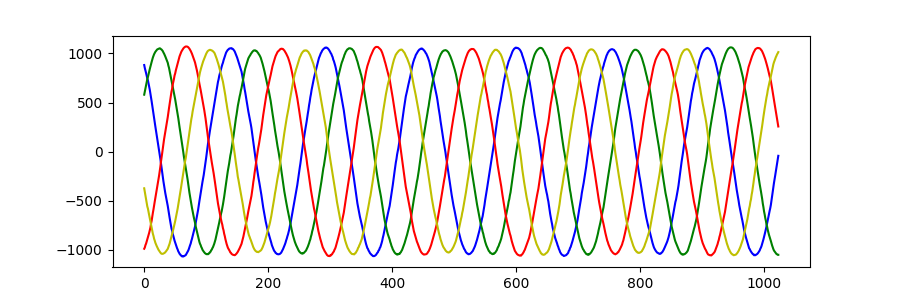

# Antsdr libiio interface
This Repository is used to show how to config device and get stream by libiio.
You can use a centimeter.

## Hardware 
1. Microphase antsdr E310
2. Signal generator(antsdr TX1)

## Dependent library
1. libiio
2. matplotlib-cpp(The purpose of using matplotlib-cpp here is to facilitate and quickly display the effect)

## Result

### Official Factory Firmware (plutosdr)
The sending signal frequency is 10K

**blue is rx1i**

**gree is rx1q**

**red is rx2i**

**yello is rx2q**

The official firmware can see that the phase difference between the rx1 and rx2 channels is 180 degrees.

